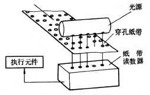
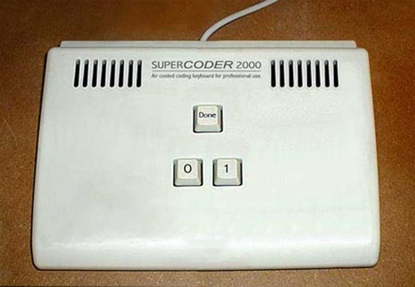

# 从001到OOP

世界上第一台计算机是在1946年的情人节诞生的，计算机语言却不知道是什么时候开始形成的，大家都知道计算机是怎么产生的，差不多就是几根线几个逻辑开关组成的电路，然后根据线的通和断这种二进制的特性来存储数据（可以看看这篇文章），如果单是学习计算机语言，并不要这么深入，我们只需了解。

## 一、机器语言

机器语言就是最底层的计算机语言，也就是只有 0 和 1，那时候的程序员，不仅要懂编程，还要知道计算机的内部构造，因为他们是直接对计算机内部的寄存器进行赋值的。怎么将 0 和 1 的信息传入计算机内部呢？相传很久以前的程序员是通过在纸带上面打洞洞编程的，如下图。


这种工具看上去很好玩，可想而知这一件多么复杂又无趣的工作，而且打错了怎么办。这个原理就是通过光信号将纸带上的二进制数读入计算机的，如下图。



是不是感觉很神奇，还有说法就是牛逼的程序员都是这样编程的，如下图，如果计算机语言不发展，还是这个样子的话，我敢肯定，程序员会死的更多的。



## 二、汇编语言

这个二进制用来编程太麻烦了，写个250250就要用 111101000110001010 这么长的数来存储，而且这还只是两个 250，用二进制写出来，我可不敢保证下次看到它，还会发现它是个 250。人类是聪明的，而程序员是最聪明的，他们知道用一些用一些英文单词来代替一些常用的二进制操作码。
我想要给一个寄存器赋值，以前赋值的操作要用一串二进制码，寄存器的地址也要一串二进制码，如果将这赋值的操作码用一个英文单词来代替，寄存器也用一个英文单词来代替，然后在用一种方法把它们翻译成二进制码送给计算机不就行了吗？真是机智如我。
把赋值的操作就取成 Move 吧！这个寄存器叫 AX 吧！简单点，说话的方式简单点，把Move 缩写成 mov 吧！于是，前面的赋值操作就成这样了，假设赋的值是 250。

```
mov ax,250
```

是不是很简单，汇编语言就是这么个东西。

## 三、POP（Procedure Oriented Programming）

汇编语言就够了吗？计算机都高速发展了，运行速度成倍的增加，汇编语言小打小闹还行，处理复杂的问题就不给力了，不过有时候不是不给力，而是出现了和机器码同样的命运，就是处理复杂的问题可读性太差。从机器码到汇编，是用一些英文单词代替汇编常用的操作数，于是程序员想，怎么提高汇编处理问题的能力呢？于是就把汇编处理问题一些常用的套路再用一些英文单词来代替，这方法是不是有点熟悉。于是就有了 C 语言这样的高级语言。
C 语言是由汇编而来，所以它可以高效率地开发系统程序。它是面向过程编程（Procedure Oriented Programming）的高级语言，就是做所有事情，只在乎做的过程和结果。用面向过程的计算机语言来处理问题，但还是有缺点，不能满足生产需要，处理问题的方式也不够接近人的思维。比如，写程序实现打人的功能，用面向过程的方法实现，代码如下：

```c
void main(){
	beat(打的人,被打的人);		//实现了打人的方法
}
```

## 四、OOP（Object Oriented Programming）

计算机语言此时已经趋于成熟了，但为了更接近人的思维，面向对象编程（Object Oriented Programming）的语言就被发明出来了。OOP处理问题时主要让人注重方法实施的对象，而不是方法，这让编程的逻辑更容易理解。面向对象本身就是个比较抽象的东西，这得慢慢去体会。
比如用面向过程编程实现打人的操作，写法上只是注重打人这个过程，并不在意打的人和被打的人，而面向对象编程的思想则相反，比如写程序实现打人的功能，用Java面向对象的方法实现，代码如下：

```java
public class Example{
	public static void main(Strng[] args){
		Person XiaoMing = new Person();		//定义一个打的人
		Person XiaoHua = new Person();		//定义一个被打的人
		XiaoMing.beat(XiaoHua);				//小明打小花
	}
}

class Person{
	public void beat(Person p){
		//这里是实现打人的方法
	}
}
```

从001（机器码）到OOP（面向对象编程）的这个过程代表着计算机语言的发展，这也代表了计算机应用的发展。


