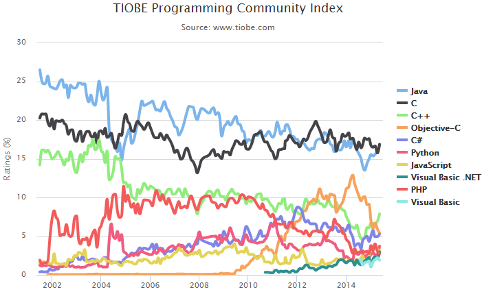
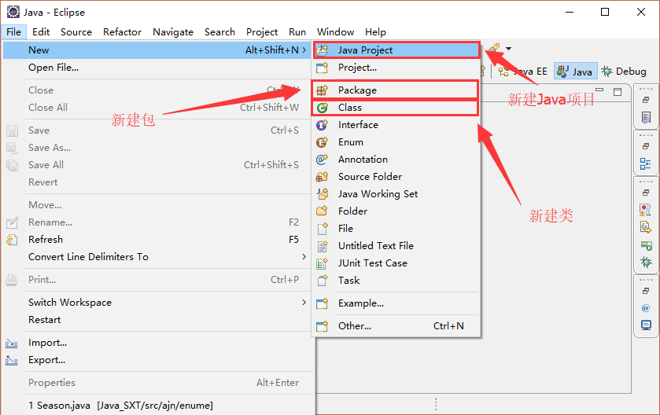

# 登上爪哇岛

## 一、Java简史


360百科：[https://baike.so.com/doc/2886868.html?sid=3046592](https://baike.so.com/doc/2886868.html?sid=3046592)

维基百科：[https://en.wikipedia.org/wiki/Java_(programming_language)](https://en.wikipedia.org/wiki/Java_(programming_language))

## 二、Java组成

- Java编程语言。
- Java文件格式。
- Java虚拟机(JVM)。
- Java应用程序接口(Java API)。

## 三、Java体系

**Java SE**
Java SE(Java Platform,Standard Edition)。Java SE以前称为J2SE。它允许开发和部署在桌面、服务器、嵌入式环境和实时环境中使用的Java应用程序。Java SE包含了支持Java Web服务开发的类，并为Java Platform,Enterprise Edition(Java EE)提供基础。
**Java EE**
Java EE(Java Platform,Enterprise Edition)。这个版本以前称为J2EE。企业版本帮助开发和部署可移植、健壮、可伸缩且安全的服务器端Java应用程序。Java EE是在Java SE的基础上构建的，它提供Web服务、组件模型、管理和通信API，可以用来实现企业级的面向服务体系结构(service-oriented architecture,SOA)和Web 2.0应用程序。
**Java ME**
Java ME(Java Platform,Micro Edition)。这个版本以前称为J2ME，也叫K-JAVA。Java ME为在移动设备和嵌入式设备（比如手机、PDA、电视机顶盒和打印机）上运行的应用程序提供一个健壮且灵活的环境。Java ME包括灵活的用户界面、健壮的安全模型、许多内置的网络协议以及对可以动态下载的连网和离线应用程序的丰富支持。基于Java ME规范的应用程序只需编写一次，就可以用于许多设备，而且可以利用每个设备的本机功能。



## 四、Java开发环境与工具

### 1. JDK(Java Development Kit)

jdk是Java语言的软件开发工具包，主要用于移动设备、嵌入式设备上的java应用程序。
**JDK包含的基本组件**

|      程序      |                   功能                   |
| :----------: | ------------------------------------|
|    javac     |             编译器，将源程序转成字节码              |
|     jar      |          打包工具，将相关的类文件打包成一个文件           |
|   javadoc    |            文档生成器，从源码注释中提取文档            |
|     jdb      |             debugger，查错工具              |
|     java     |        运行编译后的java程序(.class后缀的)         |
| appletviewer |   小程序浏览器，一种执行HTML文件上的Java小程序的Java浏览器   |
|    Javah     | 产生可以调用Java过程的C过程，或建立能被Java程序调用的C过程的头文件 |
|    Javap     | Java反汇编器，显示编译类文件中的可访问功能和数据，同时显示字节代码含义  |
|   Jconsole   |            Java进行系统调试和监控的工具            |

**常用的包：**

|      包名       | 功能                                       |
| :-----------: | ---------------------------------------- |
|   java.lang   | 这个是系统的基础类,比如String等都是这里面的,这个包是唯一一个可以不用引入(import)就可以使用的包 |
|    java.io    | 这里面是所有输入输出有关的类，比如文件操作等                   |
|   java.nio    | 为了完善io包中的功能，提高io包中性能而写的一个新包，例如NIO非堵塞应用   |
|   java.net    | 这里面是与网络有关的类，比如URL，URLConnection等         |
|   java.util   | 这个是系统辅助类，特别是集合类Collection，List，Map等      |
|   java.sql    | 这个是数据库操作的类，Connection，Statement，ResultSet等 |
| javax.servlet | 这个是JSP，Servlet等使用到的类                     |

**Java环境搭建**

- 从[www.oracle.com](https://www.oracle.com/downloads/index.html)官网免费下载JDK安装程序，下载好后安装，Windows系统下一般安装完成后会自动配置环境变量，如果没有，自行配置。
- Windows下配置JDK环境变量：Windows下右击**我的电脑->属性->高级->环境变量**，在这里设置Java的开发环境变量，在系统变量中新建`JAVA_HOME`变量，变量值填写JDK的安装目录(例：`D:\Java\jdk1.7.0`)。然后找到Path变量并编辑，在变量值后添加`%JAVA_HOME%\bin;%JAVA_HOME%\jre\bin;`，变量值之间用;隔开。最后新建CLASSPATH变量，变量值填写`.;%JAVA_HOME%\lib;%JAVA_HOME%\lib\tools.jar`（注意最前面有一点）；
- Linux下配置JDK环境变量，Linux下在"`/etc/.bash_profile`"文件下的环境变量设置，在后追加代码：

```shell
JAVA_HOME=/opt/jdk1.7.0
CLASSPATH=.:$JAVA_HOME/lib/toolsjar:$JAVA_HOME/lib/dt.jar
PATH=$PATH:$JAVA_HOME/bin:.
export JAVA_HOME CLASSPATH PATH
```

- 检验是否安装成功，在Windows下的cmd或者Linux的终端下输入java -version若显示版本信息，则说明安装和配置成功。

### 2. JRE(Java Runtime Environment)

JRE是运行JAVA程序所必须的环境的集合，包含JVM标准实现及Java核心类库，还包括Java虚拟机(JVM)、和支持文件。

JVM是Java Virtual Machine(Java虚拟机)的缩写，JVM是一种用于计算设备的规范，它是一个虚构出来的计算机，是通过在实际的计算机上仿真模拟各种计算机功能来实现的。

Java语言的一个非常重要的特点就是与平台的无关性。而使用Java虚拟机是实现这一特点的关键。一般的高级语言如果要在不同的平台上运行，至少需要编译成不同的目标代码。而引入Java语言虚拟机后，Java语言在不同平台上运行时不需要重新编译。Java语言使用Java虚拟机屏蔽了与具体平台相关的信息，使得Java语言编译程序只需生成在Java虚拟机上运行的目标代码(字节码)，就可以在多种平台上不加修改地运行。Java虚拟机在执行字节码时，把字节码解释成具体平台上的机器指令执行。这就是Java的能够"一次编译，到处运行"的原因。

如果只是需要在电脑上运行Java程序而不做开发，则只需安装JRE。

### 3. eclipse(IDE)

Eclipse是一个开放源代码的、基于Java的可扩展开发平台。就其本身而言，它只是一个框架和一组服务，用于通过插件组件构建开发环境。

下载地址：[www.eclipse.org](http://www.eclipse.org/)

Eclipse的插件机制是轻型软件组件化架构。在富客户机平台上，Eclipse使用插件来提供所有的附加功能，例如支持Java以外的其他语言。已有的分离的插件已经能够支持C/C++(CDT)、Perl、Ruby，Python、telnet和数据库开发。插件架构能够支持将任意的扩展加入到现有环境中，例如配置管理，而决不仅仅限于支持各种编程语言。

Eclipse的设计思想是：一切皆插件。Eclipse核心很小，其它所有功能都以插件的形式附加于Eclipse核心之上。Eclipse基本内核包括：图形API(SWT/Jface)，Java开发环境插件(JDT)，插件开发环境(PDE)等。



### 4. Hello world

用记事本或者Vim等文本编辑软件新建文件Hello.java写下下面代码：

```java
/***Hello world***/
public class Hello{
    public static void main(String[] args){
        System.out.println("Hello world!");
    }
}
```

然后在文件所在的地方打开**命令提示符**(Windows)或者**终端命令窗口**(Linux)，输入javac Hello.java进行编译，编译完后会在此目录下生成一个Hello.class文件。

运行输入命令java Hello，则会在命令台窗口输出Hello world!