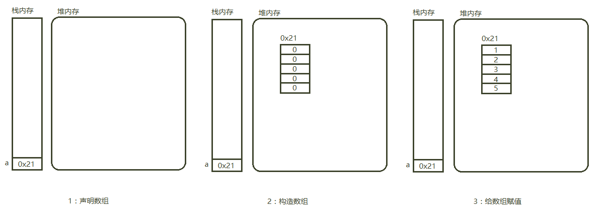
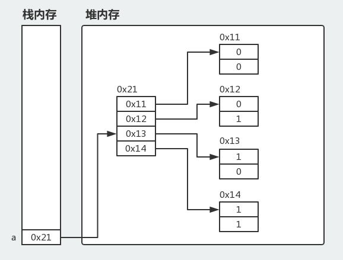
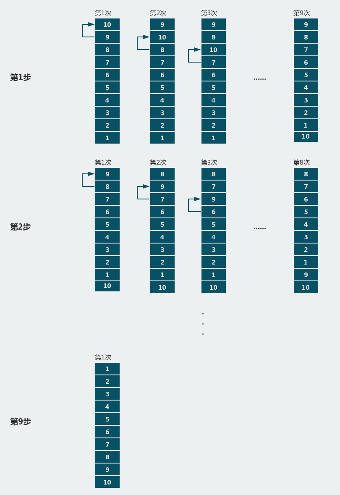
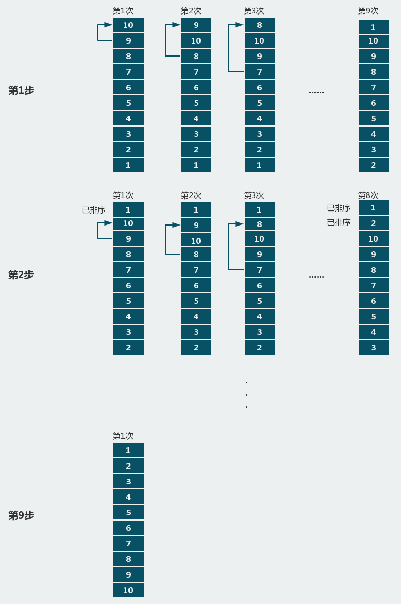
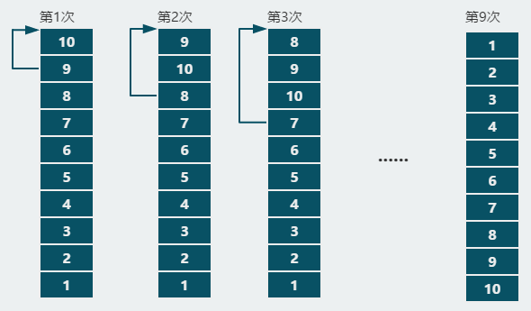
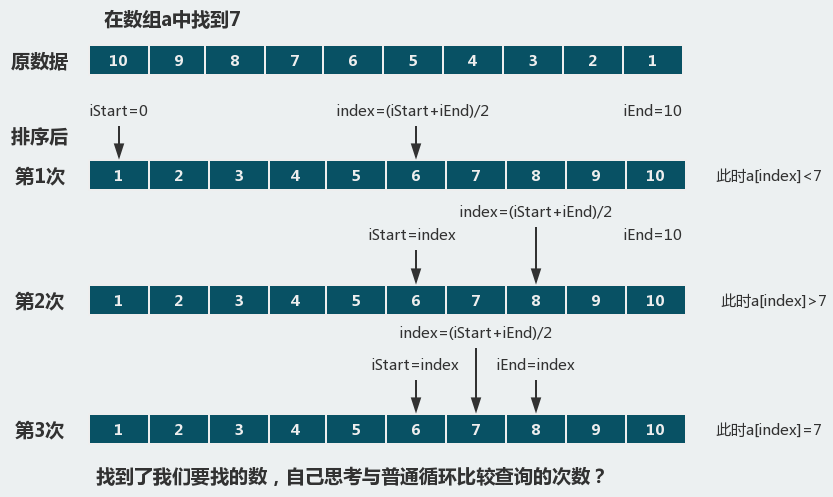

# 数组与排序

## 一、数组

在计算机语言中，通过变量来操作数据，我们之前定义的变量只能存储单个数据，而在实际应用中，经常要用到许多同类型的变量，并且是具有相同意义的一组数据，如果还是定义一组变量来处理，那就显的力不从心了，所以这种情况选用数组是必须的。

**1. 数组的定义**

数组是相同类型数据的有序集合。数组描述的是相同类型的若干个数据,按照一定的先后次序排列组合而成。其中,每一个数据称作一个数组元素,每个数组元素可以通过一个下标来访问它们。

**2. 数组的四个基本特点**

- 其长度是确定的。数组一旦被创建，它的大小就是不可以改变的。
- 其元素必须是相同类型,不允许出现混合类型。
- 数组中的元素可以是任何数据类型，包括基本类型和引用类型。
- 数组变量属引用类型， 数组也可以看成是对象 ，数组中的每个元素相当于该对象的成员变量。数组本身就是对象，Java 中对象是在堆中的，因此数组无论保存原始类型还是其他对象类型，数组对象本身是在堆中的。

**3. 数组的创建和初始化**

数组的声明有两种方式：

- int[] a; //推荐
- int a[];

**注意：**数组在声明的时候并没有实例化任何对象，所以JVM不会分配空间，此时的数组没有长度。因此，在声明数组时不能指定长度，例如：int a[5];//非法。由此得出， 声明一个数组的时候并没有数组被真正的创建，只有构造的时候才会被创建，构造一个数组，必须指定长度。

例如一维数组的创建和赋值：

```java
public class Demo01 {
	public static void main(String[] args) {
		int[] a = null;			// 1:声明数组
		a = new int[5];			// 2:构造数组
		for(int i=0;i<5;i++){
			a[i] = i;
			System.out.print(a[i]+"\t");
		}				// 3:给数组赋值
		// print: 0	1	2	3	4
	}
}
```

内存分析： 

数组的初始化：

- int[] a = {1,2,3,4,5};
- int[] a = new int[5];

数组的定义和赋值操作根据实际情况判断是否分开进行。

> 数组在没赋值初始化的时候，会按照变量一样进行默认赋值。
>
> ```java
> import java.util.Arrays;
>
> public class Demo02 {
> 	public static void main(String[] args) {
> 		int a[] = new int[2];
> 		boolean b[] = new boolean[2];
> 		String c[] = new String[2];
> 		System.out.println(""
> 				+ Arrays.toString(a)+"\n"		// print: [0, 0]
> 				+ Arrays.toString(b)+"\n"		// print: [false, false]
> 				+ Arrays.toString(c)+"\n");		// print: [null, null]
> 	}
> }
> ```
>
> 分析：Arrays为数组工具类，后面我们会讲到，现在只需了解它的功能是将数组内容以字符串的形式。

还需数组的下标是从0开始的，所以数组的下标的合法区间为[0,length-1]。

**4. 二维数组**

数组使创建数据更灵活，数组的元素可以是任何数据类型，当数组的元素是数组时，就可以构成多维数组，这在很多情况下是很有用处的，我们只讨论二维数组。

定义的方式与一维数组一样：

```java
int[][] a = \{\{0,0},{0,1},{1,0},{1,1}};
int[][] b = new int[4][2];
```

使用for循环和增强for循环遍历二维数组：

```java
public class Demo03 {
	public static void main(String[] args) {
		int[][] a = {{0,0},{0,1},{1,0},{1,1}};
		// for
		for(int i=0;i<a.length;i++){
			for (int j=0;j<a[i].length;j++) {
				System.out.print(a[i][j]+"\t");
			}
			System.out.println();
		}
		System.out.println("-----");
		// foreach
		for (int[] j : a) {
			for (int i : j) {
				System.out.print(i+"\t");
			}
			System.out.println();
		}
		// print:
		//	0	0
		//	0	1
		//	1	0
		//	1	1
	}
}
```

分析：array.length可以求出数组的长度。仔细想想为何遍历二维数组要这样使用？尝试使用for或者foreach遍历更高维的数组。

内存分析：

 

## 二、排序

**1. 冒泡排序法**

冒泡排序法的核心：依次比较相邻两个数的大小，按照顺序互换位置。

冒泡排序法步骤图： 

冒泡排序法代码如下：

```java
import java.util.Arrays;

public class Demo04 {
	public static void main(String[] args) {
		int[] a = {10,9,8,7,6,5,4,3,2,1};
		int temp;
		for(int i=0;i<a.length-1;i++){
			System.err.println("Step: "+(i+1));
			for(int j=0;j<a.length-1-i;j++){
				if(a[j]>a[j+1]){
					temp = a[j];
					a[j] = a[j+1];
					a[j+1] = temp;
				}
				System.out.println(Arrays.toString(a));
			}
			System.out.println();
		}
	}
}
```

**2. 选择排序法**

选择排序法的核心：依次选择最小的数，按照顺序互换位置。

选择排序法步骤图：



选择排序法代码如下：

```java
import java.util.Arrays;

public class Demo05 {
	public static void main(String[] args) {
		int[] a = {10,9,8,7,6,5,4,3,2,1};
		int temp;
		for(int i=0;i<a.length-1;i++){
			System.err.println("Step: "+(i+1));
			for(int j=i+1;j<a.length;j++){
				if(a[i]>a[j]){
					temp = a[j];
					a[j] = a[i];
					a[i] = temp;
				}
				System.out.println(Arrays.toString(a));
			}
			System.out.println();
		}
	}
}
```

**3. 插入排序法**

插入排序法的核心：依次将较小的数插入前面，按照顺序互换位置。

插入排序法步骤图：

 

插入排序法代码如下：

```java
import java.util.Arrays;

public class Demo06 {
	public static void main(String[] args) {
		int[] a = {10,9,8,7,6,5,4,3,2,1};
		int temp;
		for(int i=1;i<a.length;i++){
			int j=i-1;
			temp=a[i];
			for(;j>=0&&temp<a[j];j--){
				a[j+1]=a[j];
			}
			a[j+1]=temp;
			System.out.println("Step: "+i+"\n"+Arrays.toString(a)+"\n");
		}
	}
}
```

**4. 二分法查找**

我们要从一个数组中找到某个元素（指找到下标，也叫索引），常规的方法就是用循环语句遍历，这种方法就是从头到尾的把目标元素和数组中的每个元素都比较一遍，这种方法数据量大的时候明显就力不从心了。所以，我们采用二分法对数组进行查询。

二分法原理图： 

我们根据上面原理图写出代码：

```java
import java.util.Arrays;

public class Demo07 {
	public static void main(String[] args) {
		int[] a = {10,9,8,7,6,5,4,3,2,1};
		Arrays.sort(a);
		System.out.println(Arrays.toString(a));
		int elem = 7;		//要查询的元素
		int index = 0;
		int iStart = 0;
		int iEnd = a.length;
		for(int i=0;i<a.length/2;i++) {
			index = (iStart+iEnd)/2;
			if(a[index]<elem){
				iStart = index;
			}else if(a[index]>elem){
				iEnd = index;
			}else{
				System.out.println(index);
				break;
			}
		}
	}
}
```

分析：由原理可知，使用二分法查找元素时，先要对数据进行排序，而且最后返回的索引值是排序后的索引值。