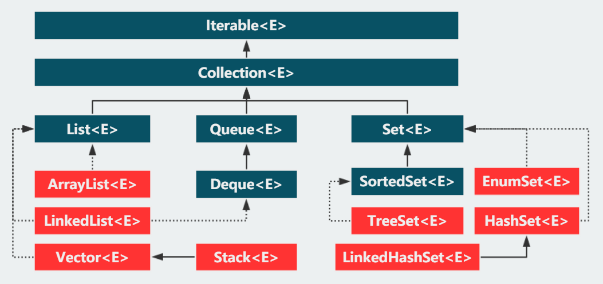

<!DOCTYPE html>
<html>

<head>
    <meta http-equiv="Content-Type" content="text/html;charset=UTF-8">
    <script src="/js/markdown.js"></script>
    <script src="/js/jquery.min.js"></script>
    <link rel="stylesheet" href="/css/bootstrap.min.css">
    <link rel="stylesheet" href="/css/content.css">
    <link rel="stylesheet" href="/css/prism.css">
    <title>集合</title>
</head>

<body>
    <textarea hidden id="content">
<!--Markdown从这里开始  -->
# 集合
---

集合和数组一样是一种数据的容器，其中可以放置对象和基本数据类型，用于管理相同数据类型的一组数据，数组是一种简单的线性序列，使用效率高，但是数组在使用时，大小需提前设定好，不能随着需求的变化而扩容。所以在复杂需求下，要使用集合来处理。

Java集合框架(Java Collections Framework, JCF)中集合可分为两大类，框架图中蓝色为接口，红色为类，实线为继承，虚线为实现。

**1. Collection**



**2. Map**


## 一、Collection集合

**1. Iterator<E>接口**

该接口使用Iterator设计模式，实现这个接口允许对象成为foreach语句的目标。主要的三个方法为：


它是对collection进行迭代的迭代器。

**2. Collection\<E\>接口**

它是Collection集合的根接口。它表示一组对象，这些对对象也称为collection的元素。JDK不提供此接口的任何直接实现，它提供更具体的子接口（如Set和List）实现。不同的实现类构成了不同的集合，它们有着各自的特点，来适应不同的需求。比如：一些collection允许有重复的元素，而另一些则不允许；一些collection是有序的，而另一些则是无序的；一些collection禁止null元素；在线程安全上也各有不同的特性。正是这些实现类的不同，组成了各色各样功能强大的集合家族。

Collection\<E\>接口提供了对集合对象进行基本操作的通用接口方法。常用方法摘要：


**3. List\<E\>接口**

它是实现有序的collection接口。此接口的用户可以对列表中每个元素的插入位置进行精确地控制。用户可以根据元素的整数索引（在列表中的位置）访问元素，并搜索列表中的元素。List通常允许重复的元素，并且如果List本身允许null元素的话，可以允许多个null元素。List和数组一样，索引值是基于0的。List接口提供了特殊的迭代器，叫ListIterator，除了允许Iterator接口提供的正常操作外，该迭代器还允许元素插入和替换，以及双向访问。还提供了一个方法来获取从列表中指定位置开始的列表迭代器。

**4. Queue\<E\>接口**

在处理元素前用于保存元素的collection。除了基本的Collection操作外，队列还提供其他的插入、提取和检查操作。每个方法都存在两种形式：一种是抛出异常（操作失败时），另一种是返回一个特殊值（null或false）。队列通常（并非一定）以FIFO（先进先出）的方式排序各个元素。除了优先级队列和LIFO队列（堆栈）外。


可知：在实现插入、移除、检查操作时，抛出异常的方法有add(e)、remove()、element()，返回特殊值的有offer(e)、poll()、peek()。

**5. Deque\<E\>接口**

一个线性collection，支持在两端插入和移除元素。（double ended queue（双端队列））。大多数Deque实现包含的元素数没有固定限制，但此接口既支持有容量限制的双端队列，也支持没有固定大小的双端队列。此接口与Queue\<E\>接口一样，提供插入、移除和检查元素的方法，且都存在两种形式：操作失败时抛出异常或返回特殊值。

此接口扩展了Queue接口。在将双端队列用作队列时，将得到FIFO行为。将元素添加到双端队列的末尾，从双端队列的开头移除元素。双端队列也可用作LIFO堆栈。就优先使用此接口而不是遗留的Stack类。

虽然Deque实现没有严格要求禁止插入null元素，但建议最好这样做。建议任何事实上允许null元素的 Deque实现用户最好*不* 要利用插入null的功能。这是因为各种方法会将null用作特殊的返回值来指示双端队列为空。

**6. Set\<E\>接口**

一个不包含重复元素的collection。最多包含一个null元素，此处模仿了数学上的set集合。因为set不包含e1.equals(e2)的元素e1和e2，所以在set中放入自定义对象时，该类要重写equals和hashCode方法。 

**7. SortedSet\<E\>接口**

进一步提供关于元素的总体排序的Set。这些元素使用其自然顺序进行排序，或者根据通常在创建有序set时提供的Comparator进行排序。该Set的迭代器将按元素升序遍历set。插入有序set的所有元素都必须实现Comparable接口（或者被指定的比较器所接受）。另外，所有这些元素都必须是可互相比较的。

**8. ArrayList\<E\>类和Vector\<E\>类**

List接口的大小可变数组的实现。实现了所有可选列表操作，并允许包括null在内的所有元素。除了实现List接口外，此类还提供一些方法来操作内部用来存储列表数组的大小。每个ArrayList实例都有一个容量。该容量是指用来存储列表元素的数组的大小。它问题至少等于列表的大小。随着向ArrayList中不断添加元素，其容量也自动增长。ArrayList类功能上大致等同于Vector类，除了此类不是同步的。示例代码：

```java
import java.util.ArrayList;
import java.util.List;

public class Demo01 {
	public static void main(String[] args) {
		List<String> list = new ArrayList<>();
		list.add("Alice");
		list.add("Bob");
		list.add(1, "Click");
		System.out.println(list);					// print: [Alice, Click, Bob]
		list.remove(1);
		System.out.println(list);					// print: [Alice, Bob]
		for (String string : list) {
			System.out.println(string);				// print:  Alice
		}                                       	 //         Bob
		for (int i = 0; i < list.size(); i++) {		 // print:  Alice
			System.out.println(list.get(i));		//         Bob
		}
	}
}
```

```java
import java.util.List;
import java.util.Vector;

public class Demo02 {
	public static void main(String[] args) {
		List<String> vector = new Vector<>();
		vector.add("Alice");
		vector.add("Bob");
		vector.add(1, "Click");
		System.out.println(vector);					// print: [Alice, Click, Bob]
		vector.remove(1);
		System.out.println(vector);					// print: [Alice, Bob]
		for (String string : vector) {
			System.out.println(string);				// print:  Alice
		}                                       	//         Bob
		for (int i = 0; i < vector.size(); i++) {	// print:  Alice
			System.out.println(vector.get(i));		//         Bob
		}
	}
}
```

分析：由上面代码可知，ArrayList类和Vector类功能实现方面大体都一样。

**9. Stack\<E\>类**

Stack类表示后进先出（LIFO）的对象堆栈。它通过五个操作对类Vector进行了扩展，允许将向量视为堆栈。它提供了通常的push和pop操作，以及取堆栈顶点的peek方法、测试椎栈是否为空的empty方法、在堆栈中查找项并确定到堆栈顶距离的searsh方法。首次创建堆栈时，它不包含项。不过，Deque接口及实现提供了LIFO堆栈操作的更完整和更一致的实现类，应优先使用它们。


```java
import java.util.Stack;

public class Demo03 {
	public static void main(String[] args) {
		Stack<String> stack = new Stack<>();
		stack.push("Alice");
		stack.push("Bob");
		stack.push("Click");
		stack.push("Ded");
		System.out.println(stack);              // print: [Alice, Bob, Click, Ded]
		String pop = stack.pop();
		System.out.println(pop);                // print: Ded
		System.out.println(stack);              // print: [Alice, Bob, Click]
	}
}
```

注意：我们应该优先使用Deque接口及实现提供了LIFO堆栈操作的更完整和更一致的实现类。

**10. LinkedList\<E\>类**

List接口的链接列表实现。实现所有可选的列表操作，并且允许所有元素（包括null）。除了实现List接口外，还实现了Deque接口，这些操作允许将链接列表用作**堆栈、队列或双端队列**。注意，此列表**不是同步**的。

 **ArrayList、Vector和LinkedList区别：**

- 三者都在java.util包中，均为可伸缩数组。
- ArrayList和Vector都是基于元素的Object[ ] array来实现的 ，所以具有数组特性：
  - 在内存中开辟一块连续的空间来存储；
  - 支持用序号（下标）来访问元素；
  - 插入元素时需要移动容器中的元素（效率低）。
- ArrayList和Vector都有初始化容量的大小，可扩充，Vector默认为原来的2倍（可自定义），ArrayList为原来的1.5倍。
- ArrayList和Vector最大的区别就是同步的使用，ArrayList的方法都不是同步的，而Vector的绝大多数方法都是同步的，线程安全的。因此，效率问题也就不言而喻了，Vector逊于ArrayList。
- LinkedList是采用双向列表实现的，对数据的索引需要从头遍历，因此随机访问效率低，但是插入数据时不需要对数据进行移动，因此插入效率高。同时，它是非线程安全的。

**ArrayList、Vector和LinkedList如何选择使用？**

根据它们三者的优缺点，当对数据的主要操作为索引或只在集合的末端增加、删除元素时，使用ArrayList或Vector效率比较高；当对数据的操作主要为指定位置的插入或删除时，使用LinkedList效率比较高；当在多线程中使用容器时（即多个线程会同时访问该容器），选用Vector较为安全。

**11. HashSet\<E\>类**

此类实现Set接口，由哈希表（实际上是一个HashMap实例）支持。它不保证set的迭代顺序；特是它不保证该顺序恒久不变，所以它是无序的。此类允许使用null元素。**此实现不是同步的**。

```java
import java.util.HashSet;

public class Demo04 {
	public static void main(String[] args) {
		HashSet<String> hashSet = new HashSet<>();
		hashSet.add("Alice");
		hashSet.add("Bob");
		hashSet.add("Click");
		hashSet.add("Ded");
		hashSet.remove("Ded");
		hashSet.add("Eric");
		hashSet.add("Frank");
		System.out.println(hashSet);				// print: [Alice, Frank, Eric, Bob, Click]
		for (String string : hashSet) {
			System.out.println(string);
		}
		// print:
		//   Alice
		//   Frank
		//   Eric
		//   Bob
		//   Click
	}
}
```

**12. LinkedHashSet\<E\>类**

具有可预知迭代顺序的Set接口的哈希表和链接列表实现。此实现与HashSet的不同之处在于，后者维护着一个运行于所有条目的双重链接列表。此链接列表定义了迭代顺序，即按照将元素插入到set中的顺序进行迭代。此实现类允许null元素，它也不是同步的，是线程不安全的。

**13.TreeSet\<E\>类**

基于TreeMap的NavigableSet实现。使用元素的自然顺序对元素进行排序，或者根据创建set时提供的Comparator进行排序，具体取决于使用的构造方法。注意，如果要正确实现Set接口，则set维护的顺序（无论是否提供了显示比较器）必须与equals一致。这是因为Set接口是按照equals操作定义的，但TreeSet实例使用它的compareTo（或compare）方法对所有元素进行比较，因此从 set的观点来看，此方法认为相等的两个元素就是相等的。即使 set 的顺序与 equals 不一致，其行为也是定义良好的；它只是违背了Set接口的常规协定。此实现也不是同步的。

```java
import java.util.TreeSet;

public class Demo05 {
	public static void main(String[] args) {
		TreeSet<Person> treeSet = new TreeSet<>();
		treeSet.add(new Person(11, "Alice"));
		treeSet.add(new Person(12, "Bob"));
		treeSet.add(new Person(11, "Click"));
		treeSet.add(new Person(14, "Ded"));
		treeSet.add(new Person(15, "Eric"));
		System.out.println(treeSet);
		// print: [Person [age=11, name=Alice], Person [age=11, name=Click], Person [age=12, name=Bob], Person [age=14, name=Ded], Person [age=15, name=Eric]]
	}
}

class Person implements Comparable<Person> {

	private int age;
	private String name;

	public Person(int age, String name) {
		super();
		this.age = age;
		this.name = name;
	}

	@Override
	public int compareTo(Person o) {
		if (this.age != o.age)
			return age > o.age ? 1 : -1;
		return this.name.compareTo(o.name);
	}

	@Override
	public String toString() {
		return "Person [age=" + age + ", name=" + name + "]";
	}

}
```

## 二、Map\<K, V\>集合


**1. Map\<K, V\>接口**

将键映射到值的对象。一个映射不能包含重复的键；每个键最多只能映射到一个值。其实现的映射可以是有序的（如TreeMap类），也有无序的（如HashMap类）。将可变对象用作映射键时要小心，当对象是映射中某个键时，如果以影响equals比较的方式更改了对象的值，则映射的行为将是不确定的。

**2. HashMap\<K, V\>类**

基于哈希表的Map接口的实现。此实现提供所有可选的映射操作，并允许使用null值和null键。此类不保证映射的顺序，特别是它不保证该顺序恒久不变。除了非同步和允许使用null之外，HashMap类与HashTable类大致相同。

```java
import java.util.HashMap;
import java.util.Map;

public class Demo06 {
	public static void main(String[] args) {
		Map<Integer, String> hashMap = new HashMap<>();
		hashMap.put(1, "Alice");
		hashMap.put(2, "Bob");
		hashMap.put(3, "Click");
		hashMap.put(3, "Click1");
		hashMap.put(4, "Ded");
		hashMap.put(5, "Eric");
		hashMap.put(null, null);
		System.out.println(hashMap);			// print: {null=null, 1=Alice, 2=Bob, 3=Click1, 4=Ded, 5=Eric}
	}
}
```

注意：HashMap不是同步的，而且键不重复，如果放入相同键数据则覆盖之前数据。

**3. LinkedHashMap\<K, V\>类**

 Map接口的哈希表和链接列表实现，具有可预知 的迭代顺序。此实现与HashMap的不同之处在于，后者维护着一个运行于所有条目的双重链接列表。此链接列表定义了迭代顺序，该迭代顺序通常就是将键插入到映射中的顺序。此类提供所有可选的Map操作，并且允许null元素。与HashMap一样，它可以为基本操作提供稳定的性能。此类也不是同步的。

**4. TreeMap\<K, V\>类**

基于红黑树（二叉树）的NavigableMap实现。该映射根据其键的自然顺序进行排序，或者根据创建映射提供的Comparator进行排序，具体取决于使用的构造方法。注意，如果要正确实现Map接口，则有序映射所保持的顺序（无论是否明确提供了比较器）都必须与equals一致。（关于与equals一致的精确定义，这是因为Map接口是按照equals操作定义的，但有序映射使用它的compareTo（或compare）方法对所有键进行比较，因此从有序映射的观点来看，此方法认为相等的两个键就是相等的，与前面讲的TreeSet类似，因为TreeSet就是由TreeMap的功能来实现的。

**5. Properties类**

Properties类表示了一个持久的属性集。Properties可保存在流中或从流中加载。属性列表中每个键及其对应值都是一个字符串。一个属性列表可包含另一个属性列表作为它的“默认值”；如果未能在原有的属性列表中搜索到属性键，则搜索第二个属性列表。 因为Properties继承于Hashtable，所以可对Properties对象应用put和putAll方法。但不建议使用这两个方法，因为它们允许调用者插入其键或值不是String的项。相反，应该使用setProperty方法。如果在“不安全”的Properties对象（即包含非String的键或值）上调用store或save方法，则该调用将失败。类似地，如果在“不安全”的Properties对象（即包含非String的键）上调用 propertyNames或 list方法，则该调用将失败。

示例代码：在F盘新建一个example.Properties文件。

```properties
age=22
name=AiJiangnan
```

编写Java代码如下：

```java
import java.io.FileInputStream;
import java.io.FileNotFoundException;
import java.io.IOException;
import java.util.Properties;

public class Demo07 {
	public static void main(String[] args) throws FileNotFoundException, IOException {
		Properties properties = new Properties();
		properties.load(new FileInputStream("F:/example.properties"));
		String age = (String) properties.get("age");
		String name = (String) properties.get("name");
		System.out.println(age);                          // print: 22
		System.out.println(name);                         // print: AiJiangnan
	}
}
```

分析：Properties文件可以作为配置参数的文件，不需要修改代码就可修改代码中使用的参数。

## 三、Collections类

此类完全由在collection上进行操作或返回collection的静态方法组成（如排序、查找、反转、替换、复制、取最小元素、取最大元素等）。


示例代码：

```java
import java.util.ArrayList;
import java.util.Collections;
import java.util.List;

public class Demo08 {
	public static void main(String[] args) {
		List<Integer> list = new ArrayList<>();
		List<Integer> list2 = new ArrayList<>();
		Collections.addAll(list, 1, 2, 3, 4, 5);
		Collections.addAll(list2, 0, 0, 0, 0, 0);
		System.out.println(list);							// print: [1, 2, 3, 4, 5]
		Collections.copy(list2, list);
		System.out.println(list2);							// print: [1, 2, 3, 4, 5]
		Collections.fill(list2, 0);
		System.out.println(list2);							// print: [0, 0, 0, 0, 0]
		System.out.println(Collections.max(list));			// print: 5
		System.out.println(Collections.min(list));			// print: 1
		Collections.reverse(list);
		System.out.println(list);							// print: [5, 4, 3, 2, 1]
		Collections.swap(list, 0, 4);
		System.out.println(list);							// print: [1, 4, 3, 2, 5]
	}
}
```
<!--Markdown从这里结束  -->
</textarea>
<div id="preview" class="container"></div>
<script>
	$("#preview").html(marked($("#content").val()));
	$("table").addClass("table table-bordered table-striped");
</script>
<script src="/js/prism.js"></script>
</body>

</html>